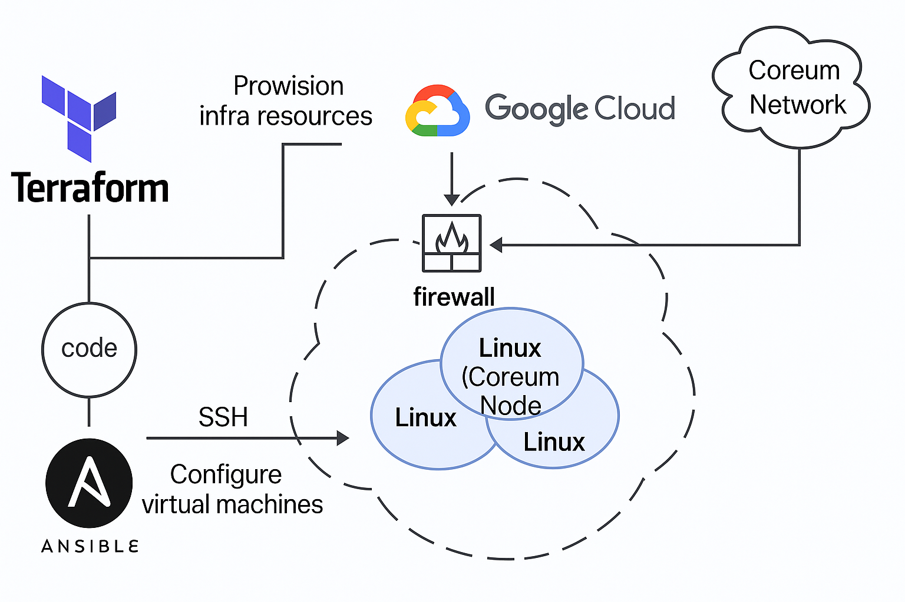

# Blockchain Node Deployment with Infrastructure as Code

This repository demonstrates how to deploy blockchain nodes using Infrastructure as Code (IaC) methodologies with Terraform and Ansible. It provides a streamlined approach for setting up production-ready blockchain nodes in the cloud with minimal manual intervention.



## What is Infrastructure as Code (IaC)?

Infrastructure as Code (IaC) is a methodology that manages and provisions computing infrastructure through machine-readable definition files rather than physical hardware configuration or interactive configuration tools. With IaC, infrastructure specifications are codified, enabling:

- **Consistency**: Identical environments across development, testing, and production
- **Repeatability**: The same environment can be recreated reliably
- **Scalability**: Easy to scale up or down as needed
- **Versioning**: Infrastructure changes can be versioned and tracked like application code
- **Automation**: Reduced manual intervention and human error

## Project Overview

This project combines two powerful IaC tools to deploy blockchain nodes:

1. **Terraform**: Provisions the cloud infrastructure (virtual machines, networking, security)
2. **Ansible**: Configures the provisioned servers and installs blockchain node software in a virtual machine (VM) environment

Using Coreum as an implementation example, this project demonstrates how to deploy a fully functional blockchain node on Google Cloud Platform (GCP) with a single command. The deployment process is designed to be user-friendly, even for those with limited technical expertise. The same approach can be adapted for other blockchain networks and cloud providers with minimal changes.

### Why Terraform?

Terraform is an open-source IaC tool that allows you to define and provision infrastructure using a declarative configuration language. Key benefits include:

- **Cloud-agnostic**: Works with multiple cloud providers (AWS, GCP, Azure, etc.)
- **Declarative syntax**: Define the desired end state, not the steps to get there
- **State management**: Tracks the current state of your infrastructure
- **Modular design**: Reuse code for common infrastructure patterns
- **Plan and apply**: Preview changes before applying them

### Why Ansible?

Ansible is an automation tool that configures systems and deploys applications. It complements Terraform by handling the configuration after infrastructure is provisioned:

- **Agentless**: No need to install software on managed nodes
- **YAML-based**: Easy-to-read playbook format
- **Idempotent**: Can be run multiple times with the same result
- **Extensive modules**: Rich library of pre-built functionality
- **Push-based**: Controls when changes are pushed to managed systems

### Benefits of Using Terraform and Ansible Together

1. **Complete automation**: End-to-end deployment process
2. **Separation of concerns**: Terraform handles infrastructure, Ansible handles configuration
3. **Reproducibility**: Environments can be recreated exactly
4. **Documentation as code**: Infrastructure and configuration serve as documentation
5. **Reduced human error**: Automation minimizes manual configuration errors
6. **Scalability**: Easily add more instances(nodes) with identical configurations

## Blockchain Node Deployment

A **blockchain node** is any device that participates in a blockchain network by maintaining a copy of the distributed ledger and communicating with other nodes. A **full node** stores the entire blockchain history, verifies all transactions and blocks according to consensus rules, and helps propagate data throughout the network. Full nodes are essential for:

- **Verifying transactions and blocks**: Ensuring all data follows protocol rules and is cryptographically valid.
- **Participating in consensus**: Some full nodes (e.g., validators) help secure the network by proposing and validating new blocks.
- **Decentralization**: Distributing copies of the ledger across many independent operators, increasing trust and resilience.
- **Providing data and APIs**: Serving blockchain data to wallets, explorers, and other applications.

This project currently implements deployment for Coreum blockchain nodes but can be adapted for other blockchain networks.

Visit the [Coreum Docs](https://www.coreum.com/) for more information on Coreum network

## Prerequisites

- Basic understanding of blockchain technology
- A cloud provider account and credential (Google Cloud Platform is used in examples)
- [Terraform](https://www.terraform.io/downloads.html)
- [Ansible](https://docs.ansible.com/ansible/latest/installation_guide/index.html)
- SSH key pair
- Brew (for macOS)

### Install Required Software

```bash
# Install Terraform
brew install hashicorp/tap/terraform
terraform version

# Install Ansible
brew install ansible
ansible --version
```

### Generate SSH Key (if needed)

```bash
ssh-keygen -t rsa -b 4096 -C "your_email@example.com"
```

Two files will be generated in the ~/.ssh directory:
- id_rsa (private key)
- id_rsa.pub (public key)

## Setup and Deployment

1. **Clone this repository**

```bash
git clone https://github.com/yourusername/blockchain-nodes-IaC.git
cd blockchain-nodes-IaC
```

2. **Cloud Provider Authentication**

(GCP in this example)

* Create a service account in GCP: (if you don't have one)
   - Navigate to GCP Console > IAM & Admin > Service Accounts
   - Click "Create Service Account"
   - Name your service account (e.g., "coreum-node-deployer")
   - Grant the following roles:
     - Compute Admin
     - Service Account User
     - Storage Admin (if storing state remotely)

* Create and download the JSON key file:
   - In the service account details page, go to the "Keys" tab
   - Click "Add Key" > "Create new key"
   - Select JSON format and click "Create"
   - The key file will be downloaded to your computer
   - Store this file securely (e.g., in `~/.config/gcloud/` directory)

3. **Configure Deployment Variables**

```bash
# Copy the template file
cp terraform/terraform.tfvars.template terraform/terraform.tfvars
```

Edit `terraform/terraform.tfvars` to set:
- `credentials_file` - Path to your GCP credentials JSON file
- `project_id` - Your GCP project ID
- `ssh_username` - Your desired SSH username
- `ssh_public_keys` - Map of usernames to SSH public key paths
- `ssh_allowed_ips` - List of allowed IPs for SSH access
- Node specifications (count, size, etc.)

> **Note:** Securing SSH Access
> To restrict SSH access, modify the `ssh_allowed_ips` variable in `terraform.tfvars` to include only your IP address or a range of IPs. This enhances security by limiting access to your node.

To find your public IP address, you can use the following command:

```bash
curl ifconfig.me
```

4. **Deploy Nodes**

```bash
# One-command deployment
make build
```

> **Note:**  
> Before running `make build`, visit the [Coreum documentation](https://docs.coreum.dev/docs/next/nodes-and-validators/run-full-node) and make sure the versions (e.g., `coreum_version`, `cosmovisor_version`, etc.) in `ansible/playbook.yml` are correct and up-to-date.

This command:
- Initializes Terraform
- Creates cloud infrastructure
- Configures servers with Ansible
- Starts blockchain nodes

## Manual Deployment Steps

You can also run the deployment steps individually:

```bash
# Initialize Terraform
make init

# Preview changes
make plan

# Apply changes
make apply

# Run Ansible playbook manually
make ansible
```

## Verifying Your Node

After deployment completes, SSH into your VM to check the node status:

```bash
# SSH into your VM (get command from output)
ssh -i ~/.ssh/id_rsa YOUR_USERNAME@YOUR_NODE_IP

# Check node service status
sudo systemctl status cored

# View logs
sudo journalctl -u cored -f

# Check sync status
curl -s localhost:26657/status | jq '.result.sync_info.catching_up'
```

Your node is fully synced when `catching_up` returns `false`.

## Customization

### Supporting Different Blockchain Networks

To adapt this project for other blockchain networks:

1. Modify the Ansible playbook (`ansible/playbook.yml`) to:
   - Install required dependencies
   - Download appropriate blockchain binaries
   - Configure network-specific settings

2. Update firewall rules in Terraform to allow network-specific ports

### Scaling Node Deployment

To deploy multiple nodes:

- Adjust the `node_count` variable in `terraform/terraform.tfvars`
- Modify Ansible inventory grouping if nodes require different configurations

## Troubleshooting

### Common Issues

- **SSH Connection Issues**: 
  - Check firewall rules
  - Verify SSH key permissions (should be 600)
  - Clear known hosts if IP has changed: `ssh-keygen -R YOUR_NODE_IP`

- **Node Sync Issues**:
  - Check logs: `sudo journalctl -u cored -f`
  - Verify network connectivity
  - Ensure adequate disk space

